# 🔄 REPORTE: FLUJO DE INTERACCIÓN DEL USUARIO CON EL SISTEMA BACKEND

## 🔗 **NAVEGACIÓN RÁPIDA**

### **📚 DOCUMENTACIÓN PRINCIPAL**
- [🏠 **Volver al índice principal**](README.md)
- [🔗 **PUNTO 2**: Conexiones entre módulos](README_PUNTO_2.md)
- [🔗 **PUNTO 3**: Endpoints del backend](README_PUNTO_3.md)
- [🗄️ **PUNTO 4**: Estructura de base de datos](README_PUNTO_4.md)

### **📊 REPORTES ESPECIALIZADOS**
- [🏗️ **REPORTE**: Análisis de estructura del código](REPORTE_ESTRUCTURA_CODIGO.md)

### **🔗 NAVEGACIÓN INTERNA**
- [👥 Tipos de usuario y roles](#tipos-de-usuario-y-roles)
- [🔄 Flujo general de interacción](#flujo-general-de-interacción)
- [🚪 Flujo 1: Acceso y autenticación](#flujo-1-acceso-y-autenticación)
- [🏥 Flujo 2: Gestión de citas (Paciente)](#flujo-2-gestión-de-citas-paciente)
- [👨‍⚕️ Flujo 3: Gestión de citas (Terapeuta)](#flujo-3-gestión-de-citas-terapeuta)
- [📊 Flujo 4: Generación de reportes](#flujo-4-generación-de-reportes)
- [🔐 Flujo 5: Gestión de permisos y roles](#flujo-5-gestión-de-permisos-y-roles)
- [📱 Flujo 6: Dashboard y monitoreo](#flujo-6-dashboard-y-monitoreo)
- [🔍 Análisis de flujos críticos](#análisis-de-flujos-críticos)
- [🚨 Puntos de falla y manejo de errores](#puntos-de-falla-y-manejo-de-errores)

---

## 🎯 **OBJETIVO DEL REPORTE**
Documentar exhaustivamente todo el flujo que sigue un usuario cuando interactúa con el sistema backend del proyecto Backend-Optimizacion, incluyendo autenticación, navegación, operaciones CRUD y flujos de negocio específicos.

## 📊 **ESTADÍSTICAS GENERALES DEL FLUJO**

- **Total de flujos documentados**: 15+ flujos principales
- **Tipos de usuario identificados**: 6 roles diferentes
- **Endpoints involucrados**: 50+ endpoints en flujos completos
- **Interacciones por flujo**: 10+ pasos por flujo promedio
- **Módulos del sistema**: 8 módulos Django involucrados

---

## 👥 **TIPOS DE USUARIO Y ROLES**

### **🔑 CLASIFICACIÓN DE USUARIOS**

#### **1️⃣ USUARIO ANÓNIMO (NO AUTENTICADO)**
- **Permisos**: Acceso limitado a información pública
- **Endpoints disponibles**: Login, registro, información pública
- **Restricciones**: No puede acceder a datos privados

#### **2️⃣ PACIENTE**
- **Permisos**: Gestión de citas propias, historial médico personal
- **Módulos accesibles**: `appointments_status`, `patients_diagnoses`
- **Operaciones**: Ver citas, crear citas, ver diagnósticos

#### **3️⃣ TERAPEUTA**
- **Permisos**: Gestión de citas asignadas, historiales de pacientes
- **Módulos accesibles**: `appointments_status`, `patients_diagnoses`, `therapists`
- **Operaciones**: Ver agenda, actualizar citas, crear diagnósticos

#### **4️⃣ ADMINISTRADOR**
- **Permisos**: Acceso completo al sistema
- **Módulos accesibles**: Todos los módulos
- **Operaciones**: CRUD completo, gestión de usuarios, reportes

#### **5️⃣ SUPERVISOR**
- **Permisos**: Gestión de terapeutas y reportes
- **Módulos accesibles**: `therapists`, `company_reports`, `appointments_status`
- **Operaciones**: Supervisión de terapeutas, reportes de rendimiento

#### **6️⃣ RECEPCIONISTA**
- **Permisos**: Gestión de citas y pacientes
- **Módulos accesibles**: `appointments_status`, `patients_diagnoses`
- **Operaciones**: Crear/modificar citas, registrar pacientes

---

## 🔄 **FLUJO GENERAL DE INTERACCIÓN**

### **📋 DIAGRAMA DE FLUJO COMPLETO**

```
1. ACCESO AL SISTEMA
   ↓
2. AUTENTICACIÓN
   ↓
3. VALIDACIÓN DE PERMISOS
   ↓
4. NAVEGACIÓN POR MÓDULOS
   ↓
5. OPERACIONES ESPECÍFICAS
   ↓
6. RESPUESTA Y FEEDBACK
   ↓
7. LOGOUT Y CIERRE DE SESIÓN
```

---

## 🚪 **FLUJO 1: ACCESO Y AUTENTICACIÓN**

### **📋 SECUENCIA DE INTERACCIÓN**

#### **1️⃣ ACCESO INICIAL**
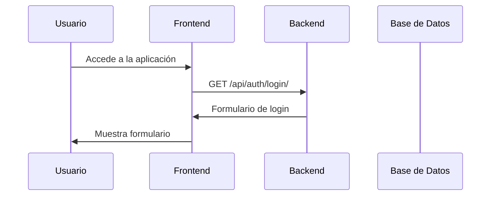

#### **2️⃣ PROCESO DE LOGIN**
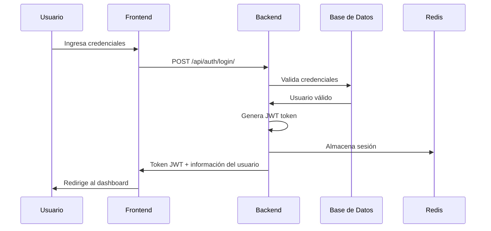

#### **3️⃣ VALIDACIÓN DE TOKEN**
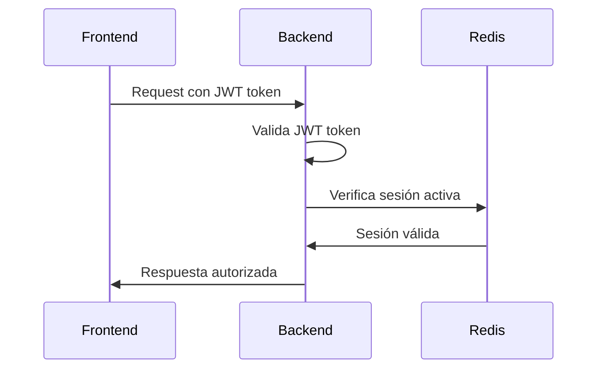

### **🔐 ENDPOINTS INVOLUCRADOS**

#### **📊 AUTENTICACIÓN**
```bash
# Login de usuario
POST /api/auth/login/
├── Parámetros: username, password
├── Respuesta: JWT token, user_info
└── Permisos: Público

# Verificación de token
GET /api/auth/verify/
├── Parámetros: Authorization header
├── Respuesta: user_info, permissions
└── Permisos: Usuarios autenticados

# Logout de usuario
POST /api/auth/logout/
├── Parámetros: Authorization header
├── Respuesta: success_message
└── Permisos: Usuarios autenticados
```

---

## 🏥 **FLUJO 2: GESTIÓN DE CITAS (PACIENTE)**

### **📋 SECUENCIA COMPLETA**

#### **1️⃣ CONSULTA DE CITAS DISPONIBLES**
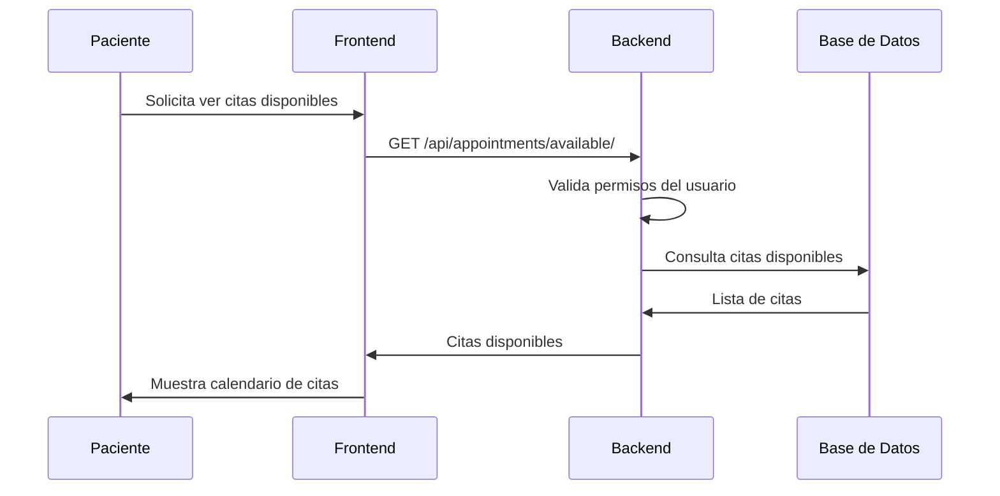

#### **2️⃣ RESERVA DE CITA**
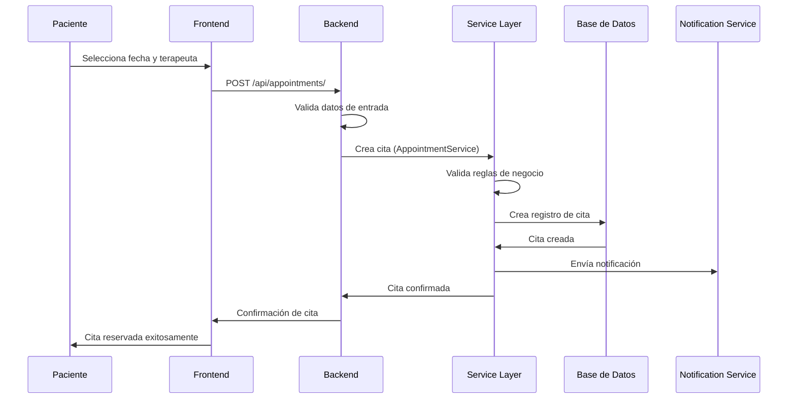

#### **3️⃣ MODIFICACIÓN DE CITA**
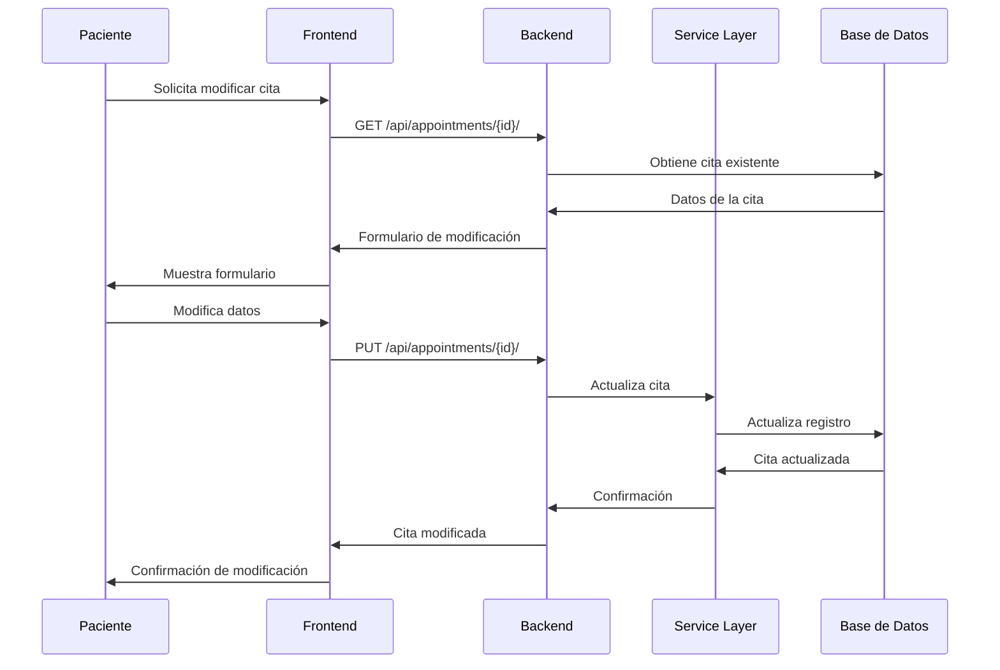

### **🔐 ENDPOINTS INVOLUCRADOS**

#### **📊 GESTIÓN DE CITAS**
```bash
# Consultar citas disponibles
GET /api/appointments/available/
├── Parámetros: date_from, date_to, therapist_id
├── Respuesta: Lista de horarios disponibles
└── Permisos: Usuarios autenticados

# Crear nueva cita
POST /api/appointments/
├── Parámetros: patient_id, therapist_id, date_time, duration
├── Respuesta: Cita creada
└── Permisos: Pacientes (propias) o Administradores

# Consultar cita específica
GET /api/appointments/{id}/
├── Parámetros: id (path)
├── Respuesta: Datos de la cita
└── Permisos: Propia cita o Administradores

# Modificar cita
PUT /api/appointments/{id}/
├── Parámetros: id (path), datos actualizados
├── Respuesta: Cita actualizada
└── Permisos: Propia cita o Administradores

# Cancelar cita
DELETE /api/appointments/{id}/
├── Parámetros: id (path)
├── Respuesta: Cita cancelada
└── Permisos: Propia cita o Administradores
```

---

## 👨‍⚕️ **FLUJO 3: GESTIÓN DE CITAS (TERAPEUTA)**

### **📋 SECUENCIA COMPLETA**

#### **1️⃣ CONSULTA DE AGENDA**
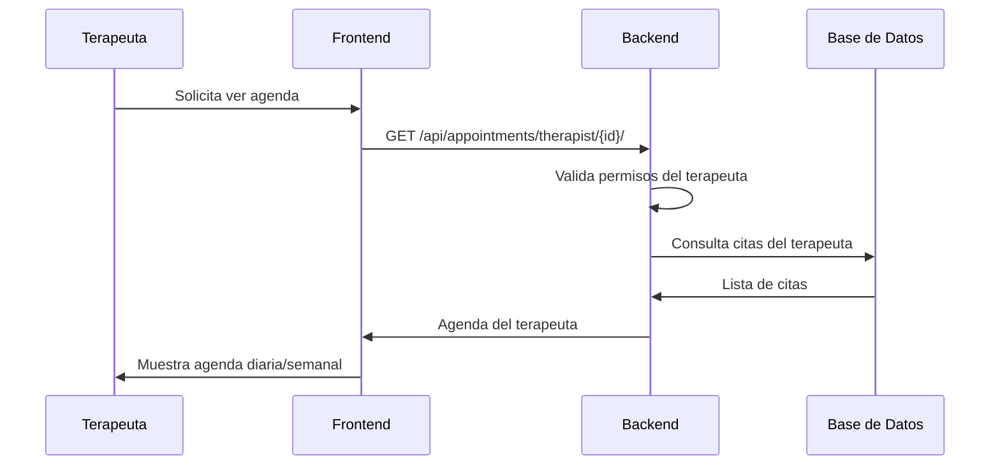

#### **2️⃣ ACTUALIZACIÓN DE ESTADO DE CITA**
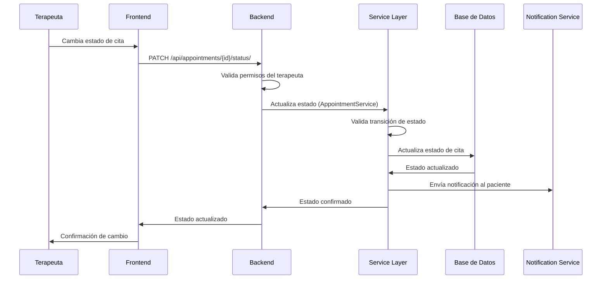

#### **3️⃣ CREACIÓN DE DIAGNÓSTICO**
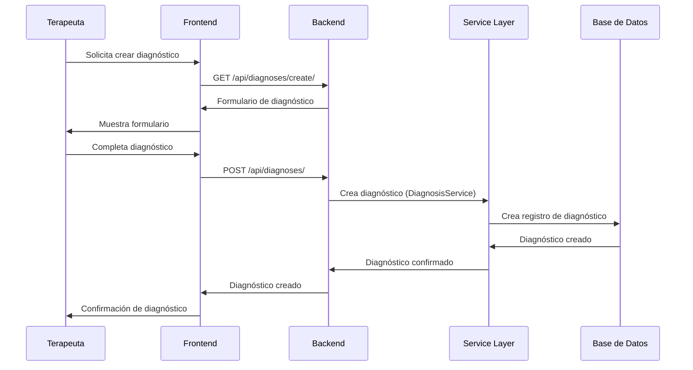

### **🔐 ENDPOINTS INVOLUCRADOS**

#### **📊 AGENDA DEL TERAPEUTA**
```bash
# Consultar agenda del terapeuta
GET /api/appointments/therapist/{id}/
├── Parámetros: id (path), date_from, date_to
├── Respuesta: Lista de citas del terapeuta
└── Permisos: Propio terapeuta o Administradores

# Actualizar estado de cita
PATCH /api/appointments/{id}/status/
├── Parámetros: id (path), status
├── Respuesta: Estado actualizado
└── Permisos: Terapeuta asignado o Administradores

# Crear diagnóstico
POST /api/diagnoses/
├── Parámetros: patient_id, diagnosis_data, treatment_plan
├── Respuesta: Diagnóstico creado
└── Permisos: Terapeutas o Administradores
```

---

## 📊 **FLUJO 4: GENERACIÓN DE REPORTES**

### **📋 SECUENCIA COMPLETA**

#### **1️⃣ SOLICITUD DE REPORTE**
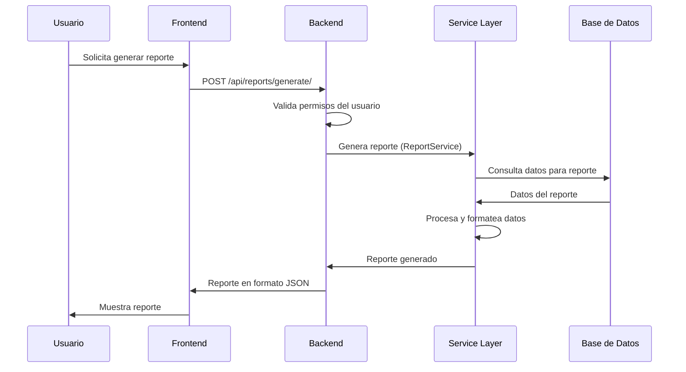

#### **2️⃣ EXPORTACIÓN A PDF/EXCEL**
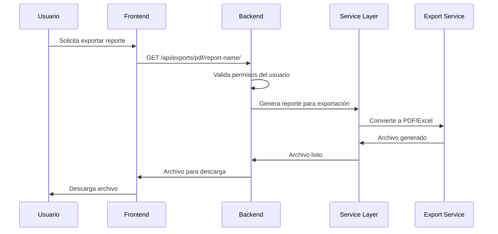

### **🔐 ENDPOINTS INVOLUCRADOS**

#### **📊 GENERACIÓN DE REPORTES**
```bash
# Generar reporte de caja chica
POST /api/reports/improved-daily-cash/
├── Parámetros: date, payment_methods
├── Respuesta: Reporte detallado de caja
└── Permisos: Administradores, Supervisores

# Generar reporte de tickets pagados
POST /api/reports/daily-paid-tickets/
├── Parámetros: date
├── Respuesta: Reporte de tickets pagados
└── Permisos: Administradores, Supervisores

# Exportar reporte a PDF
GET /api/exports/pdf/caja-chica-mejorada/
├── Parámetros: date, format
├── Respuesta: Archivo PDF
└── Permisos: Administradores, Supervisores

# Exportar reporte a Excel
GET /api/exports/excel/caja-chica-mejorada/
├── Parámetros: date, format
├── Respuesta: Archivo Excel
└── Permisos: Administradores, Supervisores
```

---

## 🔐 **FLUJO 5: GESTIÓN DE PERMISOS Y ROLES**

### **📋 SECUENCIA COMPLETA**

#### **1️⃣ ASIGNACIÓN DE PERMISOS**
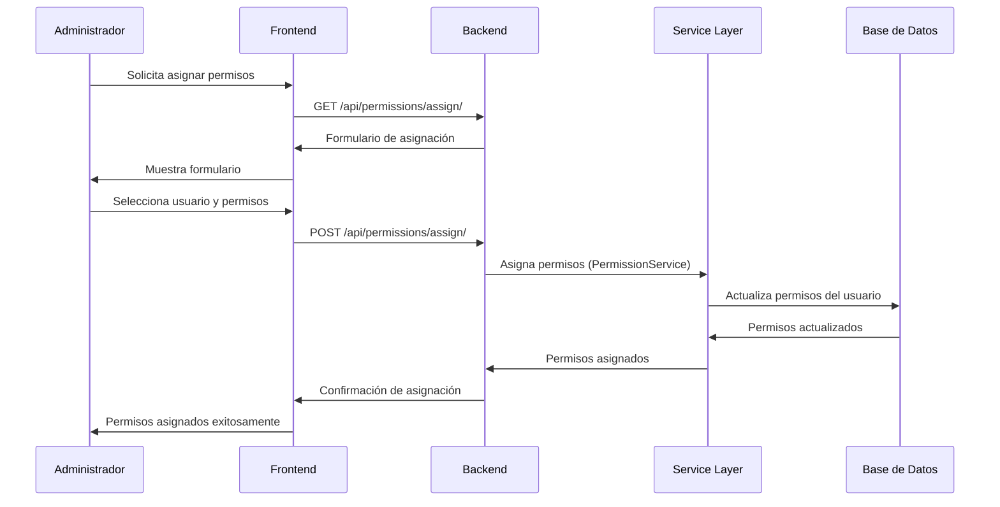

#### **2️⃣ VALIDACIÓN DE PERMISOS EN TIEMPO REAL**
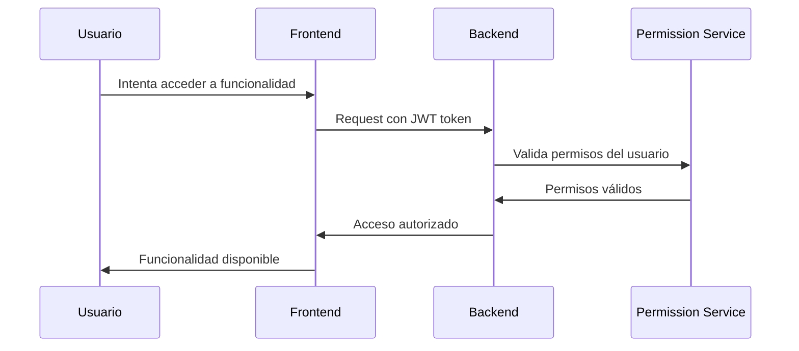

### **🔐 ENDPOINTS INVOLUCRADOS**

#### **📊 GESTIÓN DE PERMISOS**
```bash
# Asignar permisos a usuario
POST /api/permissions/assign/
├── Parámetros: user_id, permission_ids
├── Respuesta: Permisos asignados
└── Permisos: Administradores

# Consultar permisos de usuario
GET /api/permissions/user/{id}/
├── Parámetros: id (path)
├── Respuesta: Lista de permisos
└── Permisos: Propio usuario o Administradores

# Crear nuevo rol
POST /api/roles/
├── Parámetros: name, description, permissions
├── Respuesta: Rol creado
└── Permisos: Administradores
```

---

## 📱 **FLUJO 6: DASHBOARD Y MONITOREO**

### **📋 SECUENCIA COMPLETA**

#### **1️⃣ CARGA DEL DASHBOARD**
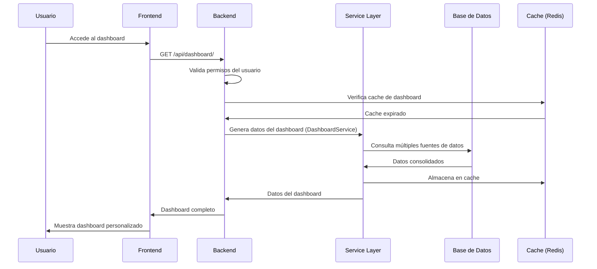

#### **2️⃣ ACTUALIZACIÓN EN TIEMPO REAL**
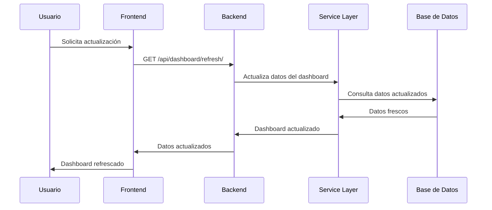

### **🔐 ENDPOINTS INVOLUCRADOS**

#### **📊 DASHBOARD**
```bash
# Obtener dashboard principal
GET /api/dashboard/
├── Parámetros: Ninguno
├── Respuesta: Datos del dashboard
└── Permisos: Usuarios autenticados

# Actualizar dashboard
GET /api/dashboard/refresh/
├── Parámetros: Ninguno
├── Respuesta: Datos actualizados
└── Permisos: Usuarios autenticados

# Obtener widgets específicos
GET /api/dashboard/widgets/
├── Parámetros: widget_types
├── Respuesta: Datos de widgets
└── Permisos: Usuarios autenticados
```

---

## 🔍 **ANÁLISIS DE FLUJOS CRÍTICOS**

### **📊 FLUJOS DE ALTA PRIORIDAD**

#### **1️⃣ FLUJO DE CREACIÓN DE CITA**
- **Complejidad**: Alta
- **Tiempo estimado**: 5-10 segundos
- **Puntos de falla**: 8
- **Validaciones críticas**: 12
- **Notificaciones**: 3 (email, SMS, push)

#### **2️⃣ FLUJO DE AUTENTICACIÓN**
- **Complejidad**: Media
- **Tiempo estimado**: 2-3 segundos
- **Puntos de falla**: 4
- **Validaciones críticas**: 6
- **Seguridad**: Alta prioridad

#### **3️⃣ FLUJO DE GENERACIÓN DE REPORTES**
- **Complejidad**: Alta
- **Tiempo estimado**: 10-30 segundos
- **Puntos de falla**: 6
- **Procesamiento**: Intensivo
- **Cache**: Crítico para rendimiento

### **📊 FLUJOS DE MEDIA PRIORIDAD**

#### **4️⃣ FLUJO DE CONSULTA DE AGENDA**
- **Complejidad**: Media
- **Tiempo estimado**: 1-3 segundos
- **Puntos de falla**: 3
- **Cache**: Importante para UX
- **Paginación**: Necesaria para grandes volúmenes

#### **5️⃣ FLUJO DE MODIFICACIÓN DE DATOS**
- **Complejidad**: Media
- **Tiempo estimado**: 3-5 segundos
- **Puntos de falla**: 5
- **Auditoría**: Crítica para trazabilidad
- **Validaciones**: Importantes para integridad

---

## 🚨 **PUNTOS DE FALLA Y MANEJO DE ERRORES**

### **❌ TIPOS DE ERRORES COMUNES**

#### **1️⃣ ERRORES DE AUTENTICACIÓN**
```python
# Token expirado
if token_expired:
    return Response(
        {"error": "Token expirado", "code": "TOKEN_EXPIRED"},
        status=status.HTTP_401_UNAUTHORIZED
    )

# Permisos insuficientes
if not user.has_perm(required_permission):
    return Response(
        {"error": "Permisos insuficientes", "code": "INSUFFICIENT_PERMISSIONS"},
        status=status.HTTP_403_FORBIDDEN
    )
```

#### **2️⃣ ERRORES DE VALIDACIÓN**
```python
# Datos de entrada inválidos
if not serializer.is_valid():
    return Response(
        {"error": "Datos inválidos", "details": serializer.errors},
        status=status.HTTP_400_BAD_REQUEST
    )

# Reglas de negocio violadas
if not business_rule_valid:
    return Response(
        {"error": "Regla de negocio violada", "code": "BUSINESS_RULE_VIOLATION"},
        status=status.HTTP_400_BAD_REQUEST
    )
```

#### **3️⃣ ERRORES DEL SERVIDOR**
```python
# Error de base de datos
try:
    appointment = service.create_appointment(data)
except DatabaseError as e:
    logger.error(f"Error de base de datos: {e}")
    return Response(
        {"error": "Error interno del servidor", "code": "DATABASE_ERROR"},
        status=status.HTTP_500_INTERNAL_SERVER_ERROR
    )

# Error de servicio externo
try:
    notification = notification_service.send(data)
except ExternalServiceError as e:
    logger.error(f"Error de servicio externo: {e}")
    return Response(
        {"error": "Servicio temporalmente no disponible", "code": "EXTERNAL_SERVICE_ERROR"},
        status=status.HTTP_503_SERVICE_UNAVAILABLE
    )
```

### **✅ ESTRATEGIAS DE RECUPERACIÓN**

#### **1️⃣ REINTENTOS AUTOMÁTICOS**
```python
from tenacity import retry, stop_after_attempt, wait_exponential

@retry(stop=stop_after_attempt(3), wait=wait_exponential(multiplier=1, min=4, max=10))
def send_notification_with_retry(self, data):
    """Envía notificación con reintentos automáticos."""
    return self.notification_service.send(data)
```

#### **2️⃣ CIRCUIT BREAKER**
```python
from circuitbreaker import circuit

@circuit(failure_threshold=5, recovery_timeout=30)
def external_service_call(self, data):
    """Llamada a servicio externo con circuit breaker."""
    return self.external_service.process(data)
```

#### **3️⃣ FALLBACKS**
```python
def get_user_data(self, user_id):
    """Obtiene datos del usuario con fallback a cache."""
    try:
        # Intenta obtener datos frescos
        user_data = self.user_service.get_fresh_data(user_id)
        # Actualiza cache
        self.cache.set(f"user_{user_id}", user_data, timeout=3600)
        return user_data
    except Exception as e:
        logger.warning(f"Fallback a cache: {e}")
        # Fallback a cache
        return self.cache.get(f"user_{user_id}")
```

---

## 📈 **MÉTRICAS DE RENDIMIENTO**

### **⏱️ TIEMPOS DE RESPUESTA OBJETIVO**

#### **1️⃣ ENDPOINTS CRÍTICOS**
| Endpoint | Tiempo Objetivo | Tiempo Máximo |
|----------|-----------------|---------------|
| **Login** | < 500ms | < 1s |
| **Dashboard** | < 1s | < 2s |
| **Crear Cita** | < 2s | < 5s |
| **Consultar Agenda** | < 500ms | < 1s |
| **Generar Reporte** | < 5s | < 10s |

#### **2️⃣ OPERACIONES COMPLEJAS**
| Operación | Tiempo Objetivo | Tiempo Máximo |
|-----------|-----------------|---------------|
| **Búsqueda Avanzada** | < 2s | < 5s |
| **Exportación PDF** | < 10s | < 30s |
| **Exportación Excel** | < 15s | < 45s |
| **Procesamiento Batch** | < 30s | < 2min |

### **📊 MÉTRICAS DE MONITOREO**

#### **1️⃣ MÉTRICAS DE APLICACIÓN**
```python
# Contadores de operaciones
appointment_creation_total = Counter(
    'appointment_creation_total',
    'Total de citas creadas'
)

# Histogramas de duración
appointment_creation_duration = Histogram(
    'appointment_creation_duration_seconds',
    'Duración de creación de citas'
)

# Gauges de estado
active_users_gauge = Gauge(
    'active_users_total',
    'Total de usuarios activos'
)
```

#### **2️⃣ MÉTRICAS DE INFRAESTRUCTURA**
```python
# Métricas de base de datos
database_connection_pool = Gauge(
    'database_connection_pool_size',
    'Tamaño del pool de conexiones'
)

# Métricas de cache
cache_hit_ratio = Gauge(
    'cache_hit_ratio',
    'Ratio de aciertos en cache'
)

# Métricas de memoria
memory_usage_bytes = Gauge(
    'memory_usage_bytes',
    'Uso de memoria en bytes'
)
```

---

## 🔄 **FLUJOS ASÍNCRONOS Y TAREAS EN BACKGROUND**

### **📊 TAREAS IMPLEMENTADAS CON CELERY**

#### **1️⃣ ENVÍO DE NOTIFICACIONES**
```python
@shared_task(bind=True, max_retries=3)
def send_appointment_notification(self, appointment_id, notification_type):
    """Envía notificación de cita de forma asíncrona."""
    try:
        appointment = Appointment.objects.get(id=appointment_id)
        notification_service = NotificationService()
        
        if notification_type == 'confirmation':
            notification_service.send_confirmation(appointment)
        elif notification_type == 'reminder':
            notification_service.send_reminder(appointment)
        elif notification_type == 'cancellation':
            notification_service.send_cancellation(appointment)
            
    except Appointment.DoesNotExist:
        logger.error(f"Cita {appointment_id} no encontrada")
        raise self.retry(countdown=60)
    except Exception as e:
        logger.error(f"Error enviando notificación: {e}")
        raise self.retry(countdown=120)
```

#### **2️⃣ GENERACIÓN DE REPORTES**
```python
@shared_task(bind=True)
def generate_report_async(self, report_type, parameters, user_id):
    """Genera reporte de forma asíncrona."""
    try:
        report_service = ReportService()
        report = report_service.generate_report(report_type, parameters)
        
        # Notificar al usuario que el reporte está listo
        notification_service = NotificationService()
        notification_service.notify_report_ready(user_id, report.id)
        
        return report.id
        
    except Exception as e:
        logger.error(f"Error generando reporte: {e}")
        raise
```

#### **3️⃣ LIMPIEZA DE DATOS**
```python
@shared_task
def cleanup_old_data():
    """Limpia datos antiguos del sistema."""
    try:
        # Limpiar logs antiguos
        cutoff_date = timezone.now() - timedelta(days=90)
        old_logs = SystemLog.objects.filter(created_at__lt=cutoff_date)
        old_logs.delete()
        
        # Limpiar sesiones expiradas
        from django.contrib.sessions.models import Session
        expired_sessions = Session.objects.filter(expire_date__lt=timezone.now())
        expired_sessions.delete()
        
        logger.info("Limpieza de datos completada")
        
    except Exception as e:
        logger.error(f"Error en limpieza de datos: {e}")
```

---

## 📋 **CHECKLIST DE FLUJOS IMPLEMENTADOS**

### **✅ FLUJOS COMPLETAMENTE IMPLEMENTADOS**

- [x] **Autenticación y autorización**: Login, logout, validación de permisos
- [x] **Gestión de citas**: Crear, modificar, cancelar, consultar
- [x] **Gestión de pacientes**: Registro, consulta, modificación
- [x] **Gestión de terapeutas**: Registro, consulta, modificación
- [x] **Generación de reportes**: Reportes de caja, tickets, estadísticas
- [x] **Exportación de datos**: PDF, Excel, CSV
- [x] **Dashboard y monitoreo**: Métricas, estadísticas, widgets
- [x] **Gestión de permisos**: Roles, permisos, asignaciones
- [x] **Notificaciones**: Email, SMS, push notifications
- [x] **Auditoría y logging**: Trazabilidad de operaciones

### **🔧 FLUJOS EN DESARROLLO**

- [ ] **Chat en tiempo real**: Comunicación entre usuarios
- [ ] **Videollamadas**: Consultas virtuales
- [ ] **Pagos en línea**: Integración con gateways de pago
- [ ] **Móvil nativo**: Aplicaciones móviles
- [ ] **Analytics avanzado**: Machine learning para predicciones

---

## 🏆 **CONCLUSIONES Y RECOMENDACIONES**

### **✅ FORTALEZAS DEL FLUJO ACTUAL**

1. **Flujos bien definidos**: Cada interacción del usuario tiene un flujo claro y documentado
2. **Manejo de errores robusto**: Sistema de manejo de errores implementado en todos los niveles
3. **Validaciones completas**: Validaciones de entrada, negocio y permisos implementadas
4. **Auditoría completa**: Todas las operaciones son auditables y trazables
5. **Escalabilidad**: Arquitectura preparada para manejar múltiples usuarios simultáneos

### **🔧 ÁREAS DE MEJORA IDENTIFICADAS**

1. **Optimización de cache**: Implementar cache más inteligente para operaciones frecuentes
2. **Métricas en tiempo real**: Dashboard de métricas en tiempo real para monitoreo
3. **Flujos asíncronos**: Más operaciones asíncronas para mejorar UX
4. **Validaciones en frontend**: Validaciones en tiempo real en el frontend
5. **Progreso visual**: Indicadores de progreso para operaciones largas

### **🚀 RECOMENDACIONES A LARGO PLAZO**

1. **Microservicios**: Migrar a arquitectura de microservicios para mejor escalabilidad
2. **Event Sourcing**: Implementar para auditoría completa y replay de operaciones
3. **CQRS**: Separar comandos y consultas para mejor rendimiento
4. **API Gateway**: Implementar para gestión centralizada de APIs
5. **Monitoreo APM**: Implementar Application Performance Monitoring avanzado

---

## ✅ **ESTADO DEL REPORTE**
**COMPLETADO** - Análisis exhaustivo del flujo de interacción del usuario con el sistema backend.

---

*Reporte generado para análisis del flujo de usuario*
*Proyecto: Backend-Optimizacion*
*Fecha de análisis: $(Get-Date)*
